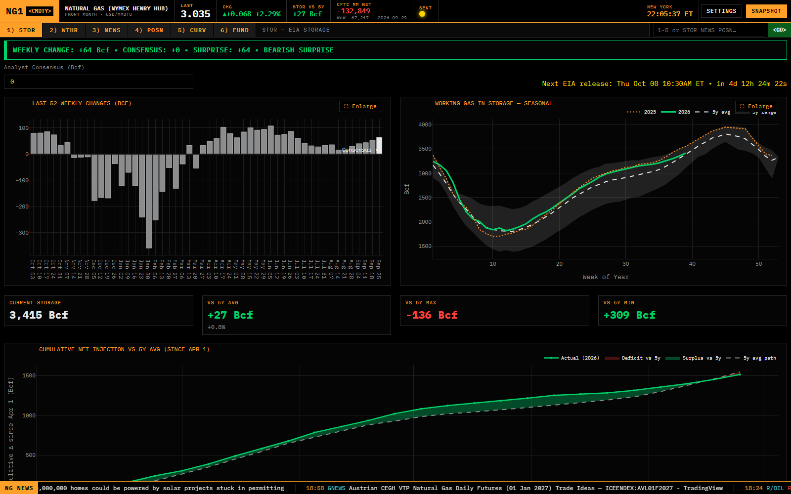
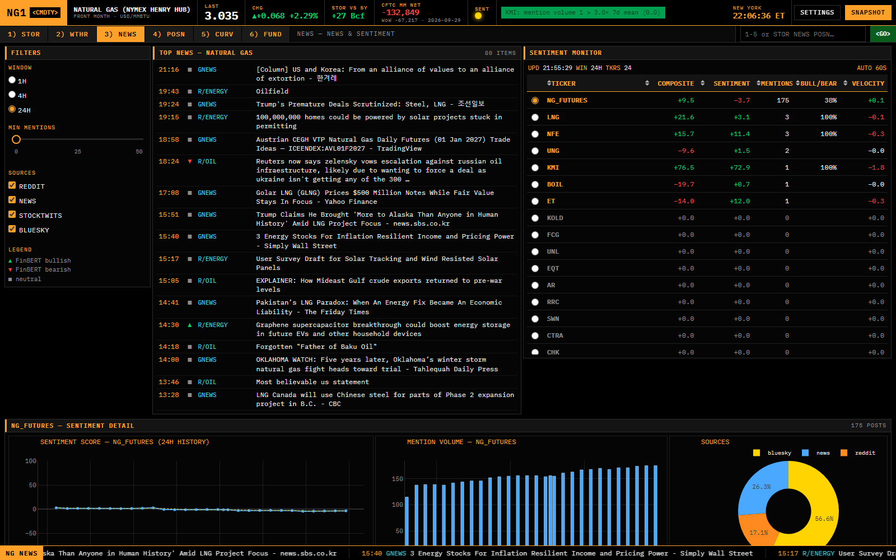
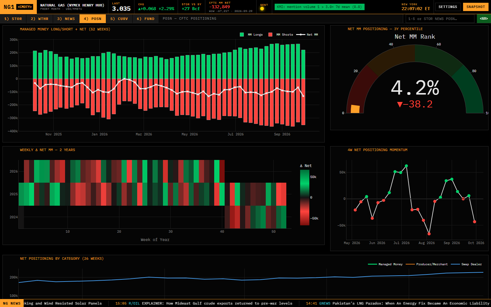
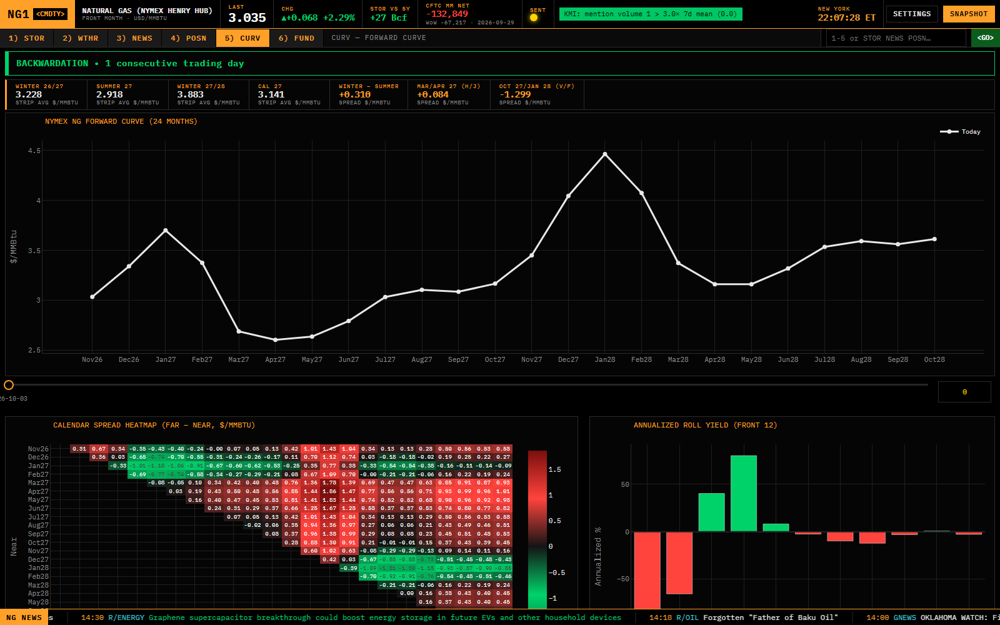
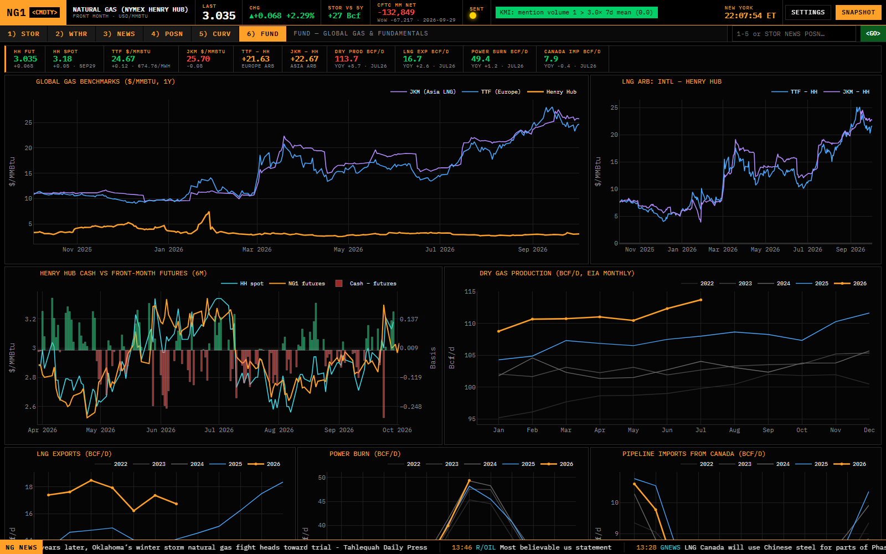
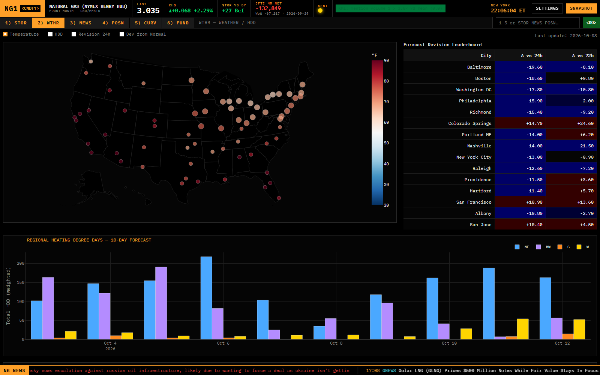
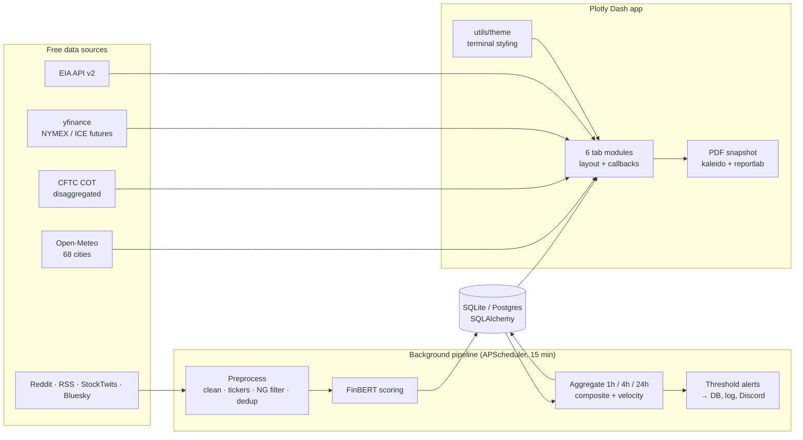

# NG Terminal: Natural Gas Trading Dashboard

A Bloomberg-terminal-style dashboard for **US natural gas (Henry Hub)** trading, built in Python with Plotly Dash. It brings together the data that moves the front of the gas curve on one screen:

- **EIA storage**, with an end-of-season storage forecast
- **Weather** forecasts for 68 US cities
- **CFTC trader positioning**
- **The full NYMEX futures curve**
- **International gas prices** (Europe TTF, Asia JKM)
- **A live news and social-media sentiment pipeline**, scored with FinBERT

Everything uses free, public data sources. No paid data feed is needed.



---

## Highlights

- **Six tabs, one terminal.** Storage, weather, news, positioning, curve and fundamentals. Switch with the tab bar, or type commands like `4`, `POSN`, `COT` or `TTF` into the `<GO>` box, the way you would on a Bloomberg terminal.
- **Live sentiment pipeline.** A background job runs every 15 minutes. It collects posts from Reddit, eight RSS news feeds, StockTwits and Bluesky, and keeps only gas-related ones. FinBERT (a finance language model) scores each post's sentiment. The scores are rolled up into per-ticker signals over 1-hour, 4-hour and 24-hour windows, and alerts fire on big moves.
- **Storage forecasting.** A model projects where US gas storage ends the season (Nov 1 or Apr 1). It starts from 10 years of seasonal patterns, then adjusts for production, LNG exports, demand and weather forecasts, and gives base/bull/bear scenarios with a confidence band.
- **Global gas and fundamentals.** Henry Hub, Dutch TTF and Asian JKM on one $/MMBtu scale, the price gap that drives US LNG exports, cash vs. futures prices, and EIA monthly production, LNG exports and power-sector demand compared year over year.
- **Terminal UI.** Black and amber theme, monospace type, a scrolling headline tape, and one-click PDF snapshots of every chart.
- **Built to keep running.** If one data source fails, the rest still update. Results are cached so switching tabs doesn't re-download data, and every timestamp is stored in UTC.

## Screenshots

| | |
|---|---|
| **News & Sentiment**: live headlines plus the FinBERT sentiment table and per-ticker detail  | **Positioning**: CFTC hedge-fund (managed money) positions, where they rank historically, and what happened to prices after past extremes  |
| **Curve**: 24-month forward curve, seasonal averages, calendar spreads, roll yield  | **Fundamentals**: global prices, export economics, cash vs. futures, EIA supply and demand  |
| **Weather**: temperature map for 68 cities, which forecasts changed most, heating-demand forecast by region  | **Storage**: weekly change vs. analyst estimate, seasonal range, end-of-season forecast, regional map  |

## What each tab shows

| Tab | Contents |
|---|---|
| **1) STOR**: EIA storage | Weekly change vs. your consensus estimate, flagged bullish or bearish. 52-week bar chart of weekly changes. Current storage vs. the 5-year range. Cumulative injections vs. the 5-year average. **End-of-season forecast** with scenarios. Regional map and cards (South Central split into salt/non-salt). |
| **2) WTHR**: Weather | Map of 68 demand-weighted cities, switchable between temperature, heating degree days and forecast changes. Ranking of the biggest forecast changes vs. 24h and 72h ago. 10-day regional heating-degree-day forecast. Estimated gas demand from homes and businesses vs. the 5-year range. |
| **3) NEWS**: News & Sentiment | **Top News** feed (newest first, tagged bullish/bearish by FinBERT). Sentiment table for 24 gas tickers: composite signal, sentiment score, mention count, bull/bear ratio and velocity (how fast sentiment is changing). Per-ticker detail: score history, mention volume, source mix, most bullish and bearish posts. |
| **4) POSN**: CFTC positioning | Hedge-fund (managed money) longs, shorts and net position. Where today's net position ranks vs. the last 3 years. Two-year heatmap of weekly changes. 4-week momentum. Net positions of hedge funds vs. producers vs. swap dealers. Price moves over the 2 weeks after past extreme readings. |
| **5) CURV**: Forward curve | Market structure (contango vs. backwardation). **Seasonal averages**: next winter, next summer, the following winter, calendar 2027. Key spreads: winter minus summer, Mar/Apr, Oct/Jan. 24-month curve vs. 1 week and 1 month ago. Heatmap of every calendar spread. Annualized roll yield. |
| **6) FUND**: Fundamentals | Henry Hub, TTF (converted from €/MWh to $/MMBtu) and JKM on one scale. TTF and JKM premiums over Henry Hub. Henry Hub cash vs. front-month futures. EIA monthly production, LNG exports, power-sector demand and Canadian imports, each overlaid by year. |

The top bar always shows the front-month price and change, storage vs. the 5-year average, the hedge-fund net position, a sentiment indicator and the New York time. The bottom tape scrolls key numbers and the latest headlines.

## Architecture



- **Each tab is its own module.** Each one in `tabs/` defines its layout and its update logic, and the main `app.py` just plugs them in.
- **Data code is separate from display code.** Everything in `data/` is plain Python with no Dash imports, so it can be tested on its own.
- **Sentiment runs in the background.** The scheduler writes posts and scores to the database, and the dashboard only reads from it. Pages stay fast because scraping and scoring never happen while you browse.
- **One shared theme.** All colors and chart styles come from `utils/theme.py`, so every chart looks the same.

## Sentiment pipeline

```
APScheduler (every 15 min, first run ~20 s after start)
  └─ scraper_manager.run_all()        Reddit (PRAW or RSS) · 8 RSS feeds · StockTwits · Bluesky
       └─ preprocessor.process()      clean → extract tickers ($cashtags + company names)
                                      → keep only gas-related posts → dedup by URL
            └─ finbert_scorer          ProsusAI/finbert, batched, CPU or CUDA
                 └─ sentiment_db       keep scores with confidence ≥ 0.60
                      └─ signal_aggregator (1h, 4h, 24h)
                           composite = 0.5·sentiment + 0.3·bull/bear + 0.2·volume percentile
                      └─ alerts_sentiment
                           |composite| > 70 · |velocity| > 30 · volume > 3× 7-day mean
```

Gas-specific sources (EIA, NGI, Rigzone, Google News gas queries, gas subreddits) skip the relevance filter. General sources (CNBC, OilPrice, Seeking Alpha, r/wallstreetbets, Bluesky) only get through if a post mentions a tracked ticker or a gas keyword.

**Tracked tickers (24):**
- **ETFs:** UNG, BOIL, KOLD, FCG, UNL
- **Gas producers:** EQT, AR, RRC, SWN, CTRA, CHK, MTDR, OVV, CNX, COG
- **LNG:** LNG, CQP, NFE, TELL
- **Pipelines:** KMI, WMB, OKE, ET
- **NG_FUTURES:** a catch-all for general gas-market posts that don't name a ticker

## Data sources

| Data | Source | Refresh |
|---|---|---|
| Weekly storage (national + regional) | EIA API v2 `natural-gas/stor/wkly` | 10 min |
| Production, LNG exports, power burn, Canada imports | EIA API v2 monthly series | 6 h cache |
| Henry Hub spot | EIA API v2 `RNGWHHD` (daily) | 6 h cache |
| NYMEX NG front month + 24-month curve | yfinance `NG=F`, `NG{M}{YY}.NYM` | 30 s |
| TTF, JKM, EUR/USD | yfinance `TTF=F`, `JKM=F`, `EURUSD=X` | 15 min cache |
| Trader positioning | CFTC disaggregated COT (`com_disagg_xls_{year}.zip`) | weekly |
| Weather (68 cities, 10-day hourly) | Open-Meteo (no key needed) | 15 min |
| News & social | Reddit, Google News, NGI, EIA, Rigzone, OilPrice, CNBC, Seeking Alpha, StockTwits, Bluesky | 15 min (background) |

## Tech stack

**Python 3.11** · Plotly Dash 4 + Dash Bootstrap Components · Plotly · pandas / NumPy · Hugging Face Transformers + PyTorch (FinBERT) · SQLAlchemy 2 (SQLite by default, Postgres-ready) · APScheduler · yfinance · feedparser · requests · reportlab + kaleido

## Quick start

```bash
pip install -r requirements.txt
cp .env.example .env        # add EIA_API_KEY (free: https://www.eia.gov/opendata/register.php)
python app.py               # open http://127.0.0.1:8055
```

On first launch, FinBERT downloads its model files (~440 MB) into the Hugging Face cache. The first sentiment run starts about 20 seconds after startup.

Settings in `.env`:

| Variable | Required | Purpose |
|---|---|---|
| `EIA_API_KEY` | yes | Storage, fundamentals and the storage forecast. Can also be pasted into the in-app **Settings** panel |
| `REDDIT_CLIENT_ID` / `REDDIT_CLIENT_SECRET` / `REDDIT_USER_AGENT` | no | Uses the official Reddit API. Without it, the app falls back to Reddit's public RSS feeds, which are rate-limited |
| `DISCORD_WEBHOOK_URL` | no | Posts sentiment alerts to Discord |
| `DB_URL` | no | Defaults to `sqlite:///data/sentiment.db`. Can point to a Postgres database instead |
| `USE_GPU` | no | Set to `true` to run FinBERT on a CUDA GPU |

## Project layout

```
app.py                  shell: top bar, tab bar + <GO> box, ticker tape, settings, PDF snapshot
config.py               tickers, feeds, cities, keywords, model settings, refresh intervals
scheduler.py            background jobs (15-min pipeline, 6-hour cleanup)
tabs/                   one module per tab: storage, weather, news, positioning, curve, fundamentals
                        (+ regional_storage, embedded in the Storage tab)
data/                   data fetching and models, no Dash imports
  eia.py, trajectory.py         EIA storage + end-of-season forecast
  fundamentals.py               global prices, EIA monthly data, curve strip math
  futures.py, cftc.py, weather.py
  scraper_*.py, preprocessor.py, finbert_scorer.py,
  sentiment_db.py, signal_aggregator.py, alerts_sentiment.py
utils/theme.py          terminal colors + shared chart styling
utils/snapshot.py       multi-page PDF export
assets/custom.css       terminal styling
docs/screenshots/       images used in this README
```

## Known limitations

- **Prices are delayed, not real-time.** Yahoo Finance quotes lag the exchange, and some far-out futures months aren't always quoted.
- **No rig counts.** Baker Hughes blocks automated downloads, and no free source publishes the numbers in a readable form.
- **JKM metadata is missing.** Yahoo gives no description for the JKM contract, so its $/MMBtu units are inferred from the price level.
- **EIA monthly data lags** by about two months.
- **Reddit is partial without login.** Reddit's public RSS feeds are rate-limited, so some subreddits are skipped each run until API credentials are added.
